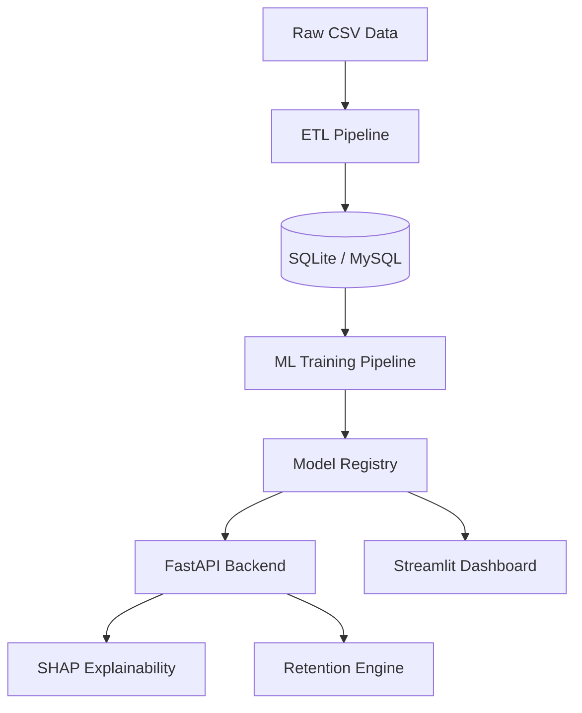

# 📉 AI-Powered Customer Churn Analytics Platform

## 1. Project Overview
This project is an end-to-end, production-ready AI solution designed to predict customer churn and generate actionable retention strategies. Unlike simple "notebook-only" projects, this is built as a complete software system featuring a **modular ETL pipeline**, a **scalable API**, and an **interactive business dashboard**.

It demonstrates the full Machine Learning lifecycle: from data ingestion and cleaning to model training, explainability, and deployment.

---

## 2. Business Problem Statement
Customer churn (attrition) is a critical metric for subscription-based businesses. Acquiring a new customer can cost **5-25x more** than retaining an existing one. 

**The Goal:** 
Proactively identify customers at high risk of churning *before* they leave and intervene with personalized offers to improve retention rates.

**Key Metrics:**
*   **Recall (Sensitivity):** Prioritized to minimize False Negatives (missing a churning customer).
*   **Customer Lifetime Value (CLTV):** Preserved by saving high-value accounts.

---

## 3. Dataset
*   **Source:** IBM Telco Customer Churn Dataset.
*   **Volume:** ~7,000 customers.
*   **Features:**
    *   **Demographic:** Gender, Senior Citizen, Partner, Dependents.
    *   **Services:** Phone, Internet (DSL/Fiber), Tech Support, Streaming.
    *   **Account:** Tenure, Contract Type, Payment Method.
    *   **Financial:** Monthly Charges, Total Charges.
*   **Target:** `Churn Label` (Yes/No).

---

## 4. System Architecture
The system follows a microservices-inspired, modular design pattern to ensure scalability and maintainability.



### Components:
1.  **ETL Layer (`src/etl`)**: Handles data ingestion, cleaning, and normalization into a relational schema.
2.  **Database Layer (`src/database`)**: SQLAlchemy ORM models managing customer and subscription data.
3.  **ML Core (`src/ml`)**:
    *   **Preprocessing**: Scikit-Learn pipelines for encoding and scaling.
    *   **Training**: Compares XGBoost, LightGBM, and Logistic Regression with class balancing.
    *   **Explainability**: SHAP (SHapley Additive exPlanations) for global and local feature importance.
    *   **Recommendations**: Rule-based engine mapping risk factors to business offers.
4.  **Serving Layer**:
    *   **API (`src/api`)**: Low-latency inference endpoints using FastAPI and Pydantic.
    *   **Dashboard (`src/dashboard`)**: Interactive UI for business stakeholders using Streamlit.

---

## 5. Technology Stack
*   **Language:** Python 3.10+
*   **Data Processing:** Pandas, NumPy, SQLAlchemy
*   **Machine Learning:** Scikit-Learn, XGBoost, LightGBM, Imbalanced-Learn
*   **Explainability:** SHAP
*   **Backend:** FastAPI, Uvicorn, Pydantic
*   **Frontend:** Streamlit, Plotly
*   **DevOps:** Docker (Optional), Pytest

---

## 6. Machine Learning & Explainability Approach
We focus on **"Glass Box" AI**—models that are accurate but also interpretable.

*   **Model Selection:** Evaluated XGBoost and LightGBM. Selected the model with the highest **Recall** on the minority class to catch as many churners as possible.
*   **Handling Imbalance:** Used `class_weight='balanced'` and `scale_pos_weight` to penalize the model heavily for missing churn cases.
*   **Explainability:** Used SHAP Waterfall plots to show exactly *why* a specific customer is predicted to churn.
    *   *Example:* "This customer is at risk because their **Monthly Charges ($100)** are high and variables **Tenure (2 months)** is low."

---

## 7. Dataset-Agnostic Design
While demonstrated on Telco data, the core architecture is **schema-agnostic**:
1.  **Config-Driven:** Column mappings and features are defined in `src/ml/features.py`. 
2.  **Generic Data Models:** The database schema separates `Customer` (Identity) from `Subscription` (Business Logic) and `ServiceDetails` (Domain Specifics), making it adaptable to SaaS, Banking, or E-commerce datasets with minimal refactoring.

---

## 8. How to Run Locally

### Prerequisites
*   Python 3.9+
*   Git

### Installation
1.  **Clone the Repository**
    ```bash
    git clone https://github.com/yourusername/churn-prediction.git
    cd churn-prediction
    ```

2.  **Set Up Environment**
    ```bash
    python -m venv venv
    # Windows
    .\venv\Scripts\activate
    # Mac/Linux
    # source venv/bin/activate
    
    pip install -r requirements.txt
    ```

### Execution Steps
The project includes a streamlined workflow. Run these commands in order from the root directory:

**Step 1: Initialize Database** (SQLite)
```bash
python -m src.database.init_db
```

**Step 2: Ingest Data** (ETL)
```bash
python -m src.etl.ingest
```

**Step 3: Train Model**
```bash
python -m src.ml.train
```

**Step 4: Launch Dashboard**
```bash
streamlit run src/dashboard/app.py
```
*Open http://localhost:8501 in your browser.*

**Step 5: Start API Server** (Optional)
```bash
uvicorn src.api.main:app --reload
```
*Docs available at http://localhost:8000/docs*

---

## 9. Future Improvements
*   **Model Monitoring:** Implement Drift Detection (e.g., EvidentlyAI) to alert when data distributions change.
*   **LLM Integration:** Replace rule-based recommendations with a Generative AI agent that drafts personalized retention emails.
*   **A/B Testing Framework:** Infrastructure to test the effectiveness of the recommended offers in production.
*   **Containerization:** Re-enable Docker Compose for cloud deployment (AWS/Azure).

---
*Built by Aryan Jalak for the purpose of demonstrating advanced AI engineering capabilities.*
